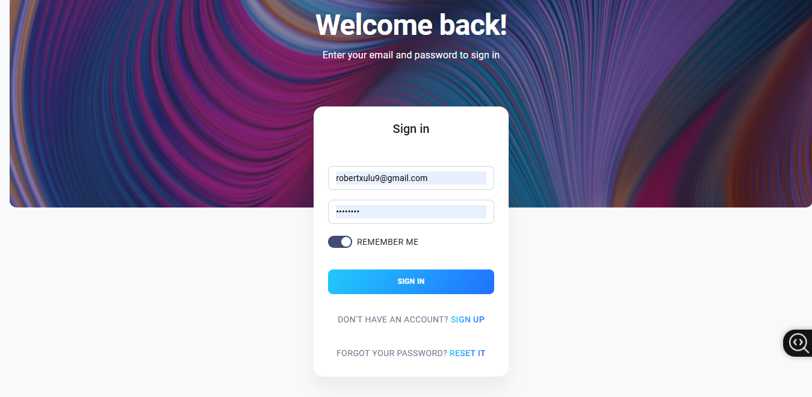
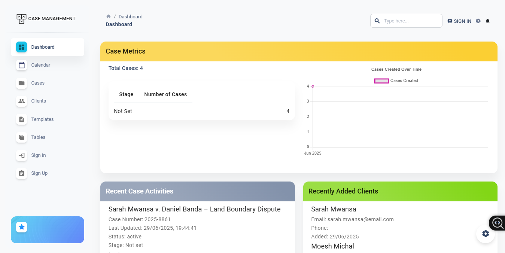
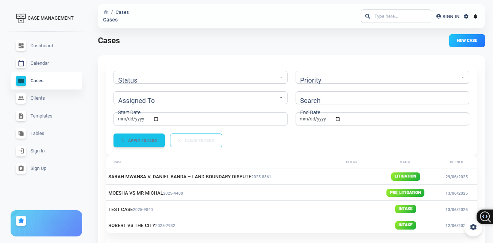
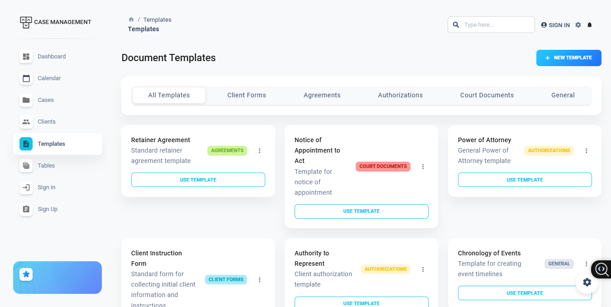
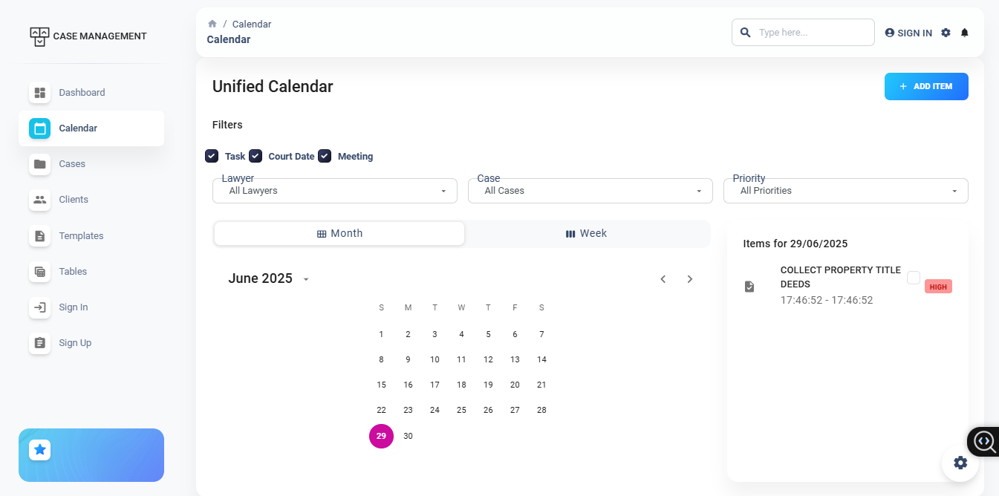
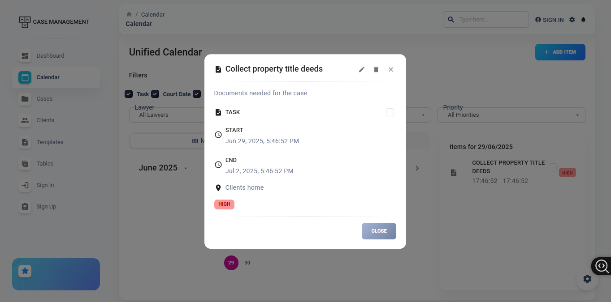

# ⚖️ Legal Case Management System

A comprehensive, full-stack web application designed to streamline the management of legal cases, documents, client interactions, and internal workflows for law firms and legal departments.

> 🚀 Built with React, Node.js, Express, and MySQL.

---

## 🧩 Features

- 🔐 **User Authentication & Role Management**
  - Secure login system
  - Role-based access control (e.g., Admin, Lawyer, Paralegal)

- 📁 **Case Management**
  - Create, assign, and track legal cases
  - View status, history, and timelines

- 🧾 **Document Automation**
  - Generate legal documents using templates (e.g., Retainer Agreement, Affidavits)
  - Auto-fill with client/case data
  - Export as PDF

- 📅 **Integrated Calendar**
  - Track court dates and deadlines
  - Automatic reminders and alerts

- 👨‍⚖️ **Client Management**
  - Store client contact and legal history
  - Log communications and notes

- 📊 **Reports & Insights**
  - Case counts by lawyer or department
  - Performance tracking

---

## 🛠 Tech Stack

| Frontend | Backend | Database | Other |
|----------|---------|----------|-------|
| React + Material UI | Node.js + Express | MySQL | JWT, date-fns, PDF generator |

---
## 🖼️ Demontration video
- https://youtu.be/TozTdIsqyVQ

## 🖼️ Screenshots

- **Login View**
  
  
- **Dashboard View**
  

- **Case Details**
  

- **Document Template Editor**
  

- **Calendar View**
  

- **Calendar task View**
  

- **Clients View**
  

---

## 📦 Installation

Clone the repository and install dependencies:

```bash
git clone https://github.com/robertxulu9/case-management-system.git
cd case-management-system

# Backend Setup
cd cms-backend
npm install
npm start

# Frontend Setup
cd ../frontend
npm install
npm start
